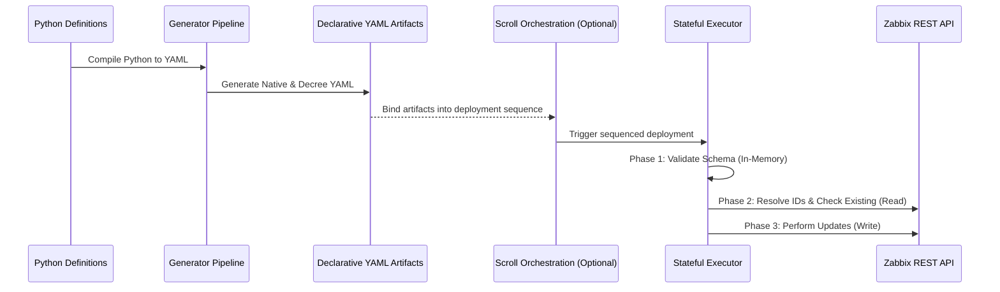

# Architecture

`zbxtemplar` is a "Monitoring as Code" engine that bridges declarative, version-controlled configuration and Zabbix's live API.

## Generation / Execution Split

The system is split into two isolated boundaries:

1. **Generation (Stateless):** Pure Python that compiles logic into declarative YAML artifacts. The generator never makes a network call, holds no API credentials, and produces identical YAML given identical inputs.
2. **Execution (Stateful):** An engine that reads declarative YAML, resolves names to internal IDs, checks existing objects, and performs updates. It is not a universal diff engine.

This separation ensures that API idempotency, ID resolution, and error handling never leak into the authoring experience.

## The Artifact Pipeline

```text
Python module -> generated YAML -> review in git -> executor/import -> live Zabbix
```

### Phase 1: Composition (Generator)

Authors write Python definitions (`TemplarModule` for monitoring primitives, `DecreeModule` for live-state rules like user management or action routing).

The generator evaluates these definitions alongside a read-only **Context** — the generation-time registry that lets modules validate references against existing or previously generated YAML. Context accumulates across multiple `load()` calls.

The framework emits raw, declarative YAML artifacts. For native Zabbix primitives (templates/hosts), it emits Zabbix-importable YAML. For live-state primitives (actions/users), it emits Decree YAML.

### Phase 2: Orchestration (Scroll — Optional)

The **Scroll** format links disparate YAML artifacts into a coherent deployment. It is an optional orchestration layer for multi-artifact deployments, preventing dependency deadlocks during multi-stage applies (e.g., creating macros before importing templates). It is not the only execution path.

### Phase 3: Execution and Reconciliation

The Executor consumes artifacts, parses the YAML, and communicates with the live Zabbix API to push state forward.



## Why This Shape Works

- Generation is side-effect free — you can generate and validate locally without affecting production.
- YAML is the review boundary — pull requests display changes in readable YAML, preventing opaque API changes from bypassing review.
- Execution isolates complexity — live ID resolution and mutation handling stay out of definition scripts.

## Executor Safety

Because `zbxtemplar` manages production monitoring and alerting, the Executor uses defensive patterns to catch errors before mutations occur.

Where schematized executor operations are used, they follow a two-phase contract:

1. **`from_dict()` — Schema Validation:** Static analysis of parsed YAML against internal schemas. Validates structure, enforces data types, and rejects unknown keys. Happens entirely in-memory.
2. **`execute()` — Stateful Mutation:** Interaction with the Zabbix API. ID resolution against live Zabbix occurs immediately prior to writes.

This is a fail-fast validation model, not an atomic rollback system. See [Security & Safety](./security.md) for the full validation and typo-checking details.
